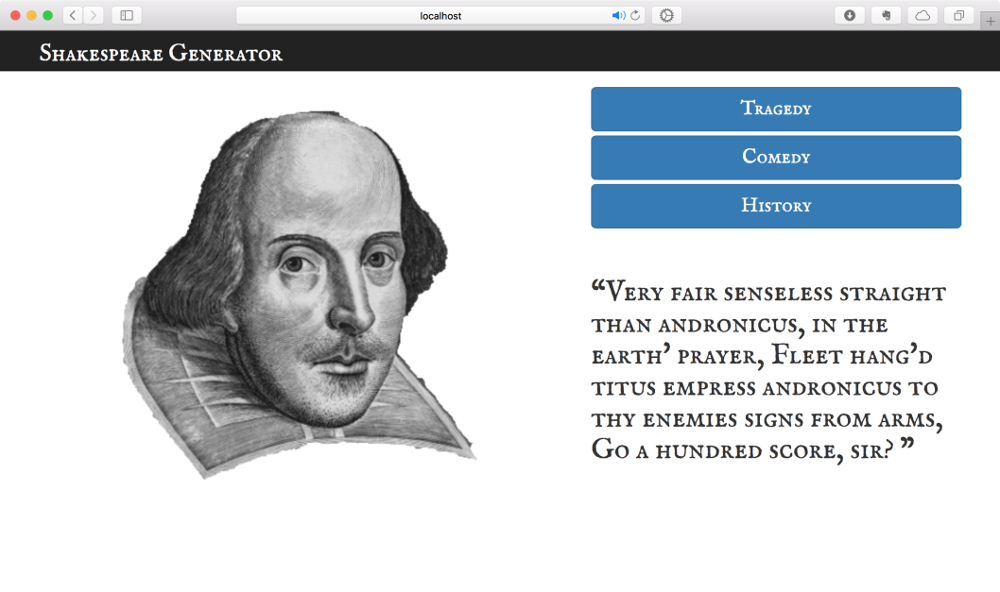

# Shakey Quotes

Our final project for COMPSCI X459.5 was web app that demonstrates a generative language RNN for Shakespeare Quotes.

Uses code moderately modified from [WILDML](http://www.wildml.com/2015/09/recurrent-neural-networks-tutorial-part-2-implementing-a-language-model-rnn-with-python-numpy-and-theano/).
